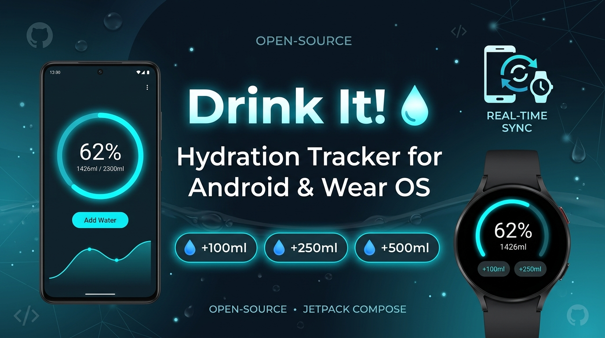
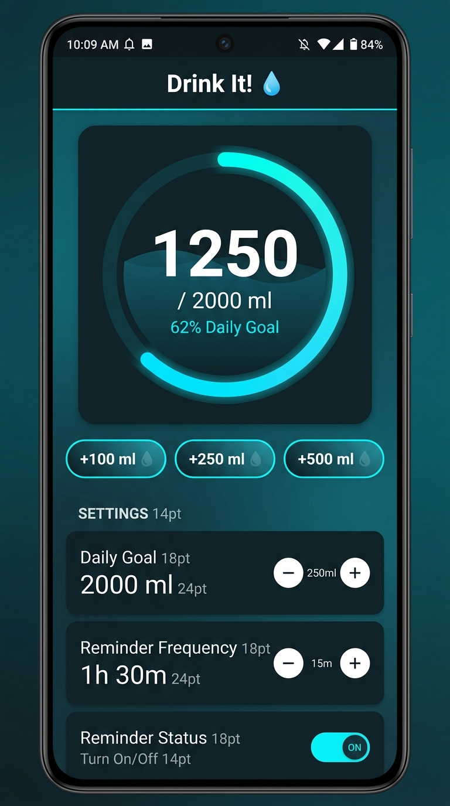
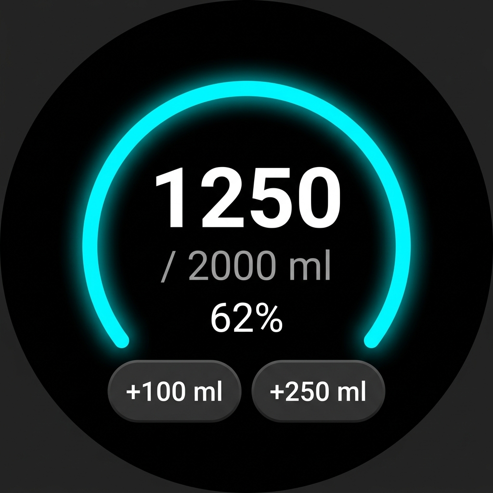

# Drink It! 💧

> **A modern, battery-efficient hydration tracker and reminder ecosystem for Android & Wear OS with real-time cross-device sync.**

<p align="center">
  
</p>

[](https://kotlinlang.org)
[](https://developer.android.com)
[](https://developer.android.com/jetpack/compose)
[](https://developer.android.com/training/wearables)
[](LICENSE)
[-orange)](#tech-stack)
[-blue)](#tech-stack)

---

## 📌 Overview

Maintaining healthy hydration habits throughout a busy workday is easy to forget, often leading to fatigue, reduced focus, and headaches. Most commercial hydration tracking applications are bloated, laden with intrusive advertisements, heavily drain battery life with background polling, or fail to sync reliably between smartwatches and smartphones.

**Drink It!** solves this with a unified, dual-module architecture built from the ground up using **Kotlin** and **Jetpack Compose**. It features **real-time bi-directional peer synchronization** over Google Play Services Wearable Data Layer, **high-reliability exact alarms** via Android `setAlarmClock` that fire even during deep Doze sleep, custom **Wear OS Watch Face Complications**, and **100% standalone capability** so either app functions seamlessly on its own without requiring the other to be installed.

---

## 📱 Visual Previews & UI Design

<table align="center">
  <tr>
    <th width="50%" align="center"><h3>📱 Android Phone UI (Material 3)</h3></th>
    <th width="50%" align="center"><h3>⌚ Wear OS Smartwatch UI</h3></th>
  </tr>
  <tr>
    <td align="center">
      
      <br /><br />
      <em>Adaptive Material 3 cards, smooth 360° progress gauge, and quick-add chips.</em>
      <br /><br />
    </td>
    <td align="center">
      
      <br /><br />
      <em>Curved ambient display, rotary-friendly scrolling, and complication support.</em>
      <br /><br />
    </td>
  </tr>
</table>

---

## ✨ Key Features

- **🔄 Real-Time Cross-Device Synchronization**:
  State changes on either device (intake logged, daily goal updated, reminder intervals changed) sync instantly via the Google Play Services Wearable Data Layer (`/water_data`).
- **🚀 100% Standalone Independence**:
  Neither app requires the other to function. Use only your watch, only your phone, or both simultaneously—zero dependency lock-in.
- **⌚ Wear OS Watch Face Complication**:
  Built-in `WaterComplicationService` provides a `RANGED_VALUE` circular progress arc, live percentage readout, and water drop icon directly on your favorite Wear OS watch faces with tap-to-open interaction.
- **⏰ Ultra-Reliable Exact Reminders**:
  Powered by `AlarmManager.setAlarmClock(...)` and `BOOT_COMPLETED` broadcast receivers. Alarms wake up on the exact millisecond, bypassing Android Doze mode and manufacturer battery restrictions.
- **⚡ Synchronized Alarm Timings**:
  Target epoch alarm timestamps are synchronized between phone and watch, ensuring notifications trigger at the exact same second across both devices without time drift.
- **🔕 Zero Duplicate Notifications**:
  Both mobile and watch notifications leverage `.setLocalOnly(true)` to prevent unwanted Bluetooth mirroring, ensuring phone alerts stay on your phone and watch alerts stay on your watch.
- **👆 One-Tap Notification Actions**:
  Log water directly from notification banners (`+100 ml`) without opening the app. Immediately syncs intake to peer devices in the background.
- **☀️ Midnight Auto-Reset**:
  Tracks `Calendar.DAY_OF_YEAR` to automatically reset daily intake to 0 ml at midnight without running persistent, battery-draining background background services.
- **🪶 Slim & Battery Optimized**:
  Full R8 minification and resource shrinking enabled. Standalone release APKs are under **1.85 MB**.

---

## 🛠️ Tech Stack

| Component | Technology | Description |
| :--- | :--- | :--- |
| **Language** | [Kotlin 2.0+](https://kotlinlang.org/) | Modern, expressive, and null-safe language |
| **Phone UI** | [Jetpack Compose (Material 3)](https://developer.android.com/jetpack/compose) | Declarative UI with custom theme and animations |
| **Wear OS UI** | [Compose for Wear OS](https://developer.android.com/training/wearables/compose) | Rotary input and `ScalingLazyColumn` optimized for round screens |
| **Complications** | [Wear Watchface Complications API](https://developer.android.com/training/wearables/watch-faces/complications) | Exposes `RANGED_VALUE`, `SHORT_TEXT`, and `MONOCHROMATIC_IMAGE` |
| **Cross-Device Sync** | [Play Services Wearable Data Layer](https://developers.google.com/android/reference/com/google/android/gms/wearable/DataClient) | Bi-directional Bluetooth/Wi-Fi `/water_data` syncing |
| **Scheduling** | [AlarmManager (setAlarmClock)](https://developer.android.com/reference/android/app/AlarmManager) | Exact wakeups bypassing Android Doze mode |
| **Persistence** | [SharedPreferences](https://developer.android.com/reference/android/content/SharedPreferences) | Lightweight local key-value store with daily calendar rollover |
| **Build System** | [Gradle (Kotlin DSL)](https://gradle.org/) + [Version Catalogs](https://docs.gradle.org/current/userguide/platforms.html) | Modular multi-project build configuration |

---

## 📂 Project Structure

```
DrinkIt/
├── app/                                 # Wear OS Smartwatch Application Module
│   ├── src/
│   │   ├── main/
│   │   │   ├── java/com/example/waterreminder/
│   │   │   │   ├── complication/        # WaterComplicationService (Watch face complication)
│   │   │   │   ├── data/                # WaterRepository (Local state & reset logic)
│   │   │   │   ├── presentation/        # MainActivity & Wear Compose UI (WaterReminderApp)
│   │   │   │   ├── receiver/            # BootReceiver, WaterActionReceiver, WaterReminderReceiver
│   │   │   │   ├── reminder/            # NotificationHelper & ReminderScheduler (AlarmManager)
│   │   │   │   └── sync/                # WearableDataSync & WearDataListenerService (Data Layer)
│   │   │   └── res/                     # Vector drawables, complication icons, layout XMLs
│   │   └── androidTest/                 # Instrumented Android unit tests (WaterRepositoryAndroidTest)
│   └── build.gradle.kts                 # Wear OS module Gradle configuration (minSdk 26, targetSdk 36)
│
├── mobile/                              # Android Smartphone Application Module
│   ├── src/
│   │   └── main/
│   │       ├── java/com/example/waterreminder/
│   │       │   ├── data/                # WaterRepository (Local state & reset logic)
│   │       │   ├── presentation/        # MainActivity & Material 3 UI (WaterReminderMobileApp)
│   │       │   ├── receiver/            # BootReceiver, WaterActionReceiver, WaterReminderReceiver
│   │       │   ├── reminder/            # NotificationHelper & ReminderScheduler (AlarmManager)
│   │       │   └── sync/                # WearableDataSync & WearDataListenerService (Data Layer)
│   │       └── res/                     # Material 3 colors, vector icons, mipmaps, strings
│   └── build.gradle.kts                 # Phone module Gradle configuration (minSdk 26, targetSdk 36)
│
├── docs/                                # Detailed technical documentation
│   ├── ARCHITECTURE.md                  # Deep-dive into sync protocols, Doze handling & complications
│   └── CONTRIBUTING.md                  # Development guidelines, conventions, and pull request steps
│
├── gradle/                              # Gradle wrapper and version catalog
│   └── libs.versions.toml               # Centralized dependencies and plugin definitions
│
├── .gitignore                           # Excludes build caches, local SDK paths, and binary outputs
├── build.gradle.kts                     # Root Gradle project build script
├── settings.gradle.kts                  # Multi-module settings including :app and :mobile
└── LICENSE                              # MIT License
```

---

## 🚀 Getting Started

### Prerequisites

- **Android Studio**: Android Studio Ladybug (2024.2+) or newer.
- **Java SDK**: JDK 17 (recommended: Android Studio bundled JBR).
- **Android SDK**: Platforms API 26 through API 36 installed.
- **Testing Environment**:
  - An Android device/emulator running Android 8.0+ (API 26+).
  - *(Optional)* A Wear OS device/emulator running Wear OS 3.0+ (API 30+).

### 1. Clone the Repository

```bash
git clone https://github.com/ParvShah2001/DrinkIt.git
cd DrinkIt
```

### 2. Build the Application

Build the debug APKs for both form factors:

```bash
# Build Mobile Phone APK
./gradlew :mobile:assembleDebug

# Build Wear OS Smartwatch APK
./gradlew :app:assembleDebug

# Build both simultaneously
./gradlew assembleDebug
```

*On Windows (PowerShell / Command Prompt):*
```cmd
gradlew.bat assembleDebug
```

### 3. Install on Devices

```bash
# Install Phone app to connected phone or emulator
./gradlew :mobile:installDebug

# Install Wear OS app to connected smartwatch or watch emulator
./gradlew :app:installDebug
```

### 4. Running Release Builds

Both modules include pre-configured R8 minification and resource shrinking:

```bash
./gradlew :mobile:bundleRelease :app:bundleRelease
```

Compiled App Bundles (`.aab`) will be generated at:
- `mobile/build/outputs/bundle/release/mobile-release.aab`
- `app/build/outputs/bundle/release/app-release.aab`

---

## 💡 Usage & Interactions

### Quick Water Logging
- **In-App**: Tap any quick-add chip (`+100 ml`, `+250 ml`, `+500 ml`). The intake progress arc updates immediately with smooth animation.
- **From Notification**: When a reminder notification appears, tap the `+100 ml` action button directly in the notification shade to log intake without opening the app.

### Setting Goals & Intervals
- Use the **[-]** and **[+]** steppers to adjust:
  - **Daily Goal**: 1,000 ml to 4,000 ml (in 250 ml increments).
  - **Reminder Frequency**: 15 minutes to 240 minutes (in 15 minute increments).

### Setting Up the Watch Face Complication
1. Long-press your Wear OS watch face and tap **Customize** (or **Edit**).
2. Select any circular or ranged complication slot.
3. Choose **Drink It!** from the provider list and pick **Water Intake**.
4. The slot will now display your real-time intake percentage and ring progress. Tapping it opens the watch app.

### Resetting Daily Progress
- Tap **Reset Progress** at the bottom of the screen. A confirmation dialog prevents accidental resets.
- Intake also resets automatically every night at 12:00 AM (midnight).

---

## 🗺️ Roadmap & Future Improvements

- [ ] **Health Connect Integration**: Two-way sync with Google Health Connect & Samsung Health hydration logs.
- [ ] **Beverage Types**: Support tracking coffee, tea, and electrolytes with custom hydration multipliers.
- [ ] **Weekly & Monthly Analytics**: Interactive bar charts and consistency streaks.
- [ ] **Wear OS Ambient Tile**: Fast glanceable swipe tile on the watch carousel.
- [ ] **Android Home Screen Widget**: Material You Glance home screen widget for phone users.

---

## 🤝 Contributing

Contributions, bug reports, and feature suggestions are welcome! Please check out the [Contributing Guidelines](docs/CONTRIBUTING.md) before submitting pull requests.

1. Fork the Project
2. Create your Feature Branch (`git checkout -b feature/AmazingFeature`)
3. Commit your Changes (`git commit -m 'feat: add amazing feature'`)
4. Push to the Branch (`git push origin feature/AmazingFeature`)
5. Open a Pull Request

---

## 📄 License

Distributed under the **MIT License**. See [`LICENSE`](LICENSE) for complete details.

---

## 👨‍💻 Author

**Parv Shah**
- GitHub: [@ParvShah2001](https://github.com/ParvShah2001)
- Repository: [https://github.com/ParvShah2001/DrinkIt](https://github.com/ParvShah2001/DrinkIt)
