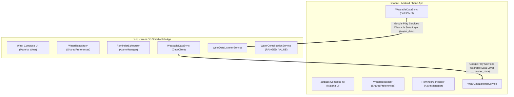

# 🏗️ Architecture & Technical Design

This document details the software architecture, synchronization protocol, and system design patterns implemented in **Drink It!**.

---

## 📐 Dual-Module Multi-Device Architecture

`Drink It!` is structured as a unified multi-module Android project containing two independent application modules sharing the same Application ID (`com.main.waterreminder`):



### 1. `:mobile` (Android Smartphone)
- Built with **Jetpack Compose Material 3**.
- Features fluid animations (`animateFloatAsState`), a responsive 360° progress gauge, quick-add cards (`+100ml`, `+250ml`, `+500ml`), goal and interval steppers, and a confirmation dialog for safety resets.
- Targets modern phones running **Android 8.0 (API 26) through Android 15 (API 36)**.

### 2. `:app` (Wear OS Smartwatch)
- Built with **Compose for Wear OS** and optimized for circular smartwatches.
- Rotary input support and `ScalingLazyColumn` for curved, battery-friendly ambient rendering.
- Implements a dedicated **Watch Face Complication Provider** (`WaterComplicationService`) exposing `RANGED_VALUE`, `SHORT_TEXT`, and `MONOCHROMATIC_IMAGE` formats.
- Marked as standalone (`standalone="true"` in `AndroidManifest.xml`), allowing it to be installed and used on a watch without requiring the phone app.

---

## 🔄 Real-Time Cross-Device Data Sync

Cross-device state synchronization is powered by the **Google Play Services Wearable Data Layer API** via the `/water_data` URI path.

### Payload Schema

| Key | Type | Description |
| :--- | :--- | :--- |
| `intake` | `Int` | Current daily water consumed (ml) |
| `goal` | `Int` | Daily target goal (ml, clamped between 1000–4000 ml) |
| `enabled` | `Boolean` | Reminder alarm toggle state |
| `interval` | `Int` | Reminder frequency (minutes, clamped between 15–240 mins) |
| `next_alarm_time` | `Long` | Target epoch millisecond timestamp for the next alarm |
| `timestamp` | `Long` | System epoch timestamp of the broadcast (for change detection) |

### Sync Mechanics & Graceful Fallback
1. **Urgent Data Delivery**: Data items are flagged as `.setUrgent()`, prompting Google Play Services to transmit data immediately over Bluetooth/Wi-Fi rather than waiting for battery-saving batch windows.
2. **Bi-Directional Event Handlers**:
   - `WaterActionReceiver.kt`: When the user taps `+100 ml` on a notification on *either* device, the receiver increments intake, reschedules the alarm, and invokes `WearableDataSync.syncToPeer(...)`.
   - `WearDataListenerService.kt`: Receives incoming data events in the background, updates local `SharedPreferences` atomically via `setCurrentIntake()`, requests watch face complication invalidation, and aligns local alarm schedules.
3. **Standalone Fallback**: If a user runs only the watch app or only the phone app, `Wearable.getDataClient(context)` calls catch failure listeners gracefully without throwing exceptions or blocking UI threads.

---

## ⏰ High-Reliability Alarm Scheduling

Hydration reminders rely on exact Android system alarms that function consistently across aggressive manufacturer battery optimizers:

```kotlin
val alarmClockInfo = AlarmManager.AlarmClockInfo(triggerTimeMs, showPendingIntent)
alarmManager.setAlarmClock(alarmClockInfo, pendingIntent)
```

### Why `setAlarmClock`?
- **Doze Mode Immunity**: Unlike standard periodic `WorkManager` or inexact alarms, `setAlarmClock` guarantees execution at the exact millisecond, even when the device enters deep Doze sleep.
- **Synchronized Firing**: Both phone and watch synchronize to the exact same `next_alarm_time` epoch timestamp, ensuring alarms trigger at the exact same second on both devices.
- **Reboot Persistence**: `BootReceiver.kt` listens for `ACTION_BOOT_COMPLETED`, `ACTION_LOCKED_BOOT_COMPLETED`, `ACTION_MY_PACKAGE_REPLACED`, and `QUICKBOOT_POWERON` to automatically restore alarm schedules immediately after reboot.

---

## 🔕 Duplicate Notification Prevention

When an Android phone posts a notification, Android OS typically mirrors that notification onto a connected Wear OS watch via Bluetooth by default.

To prevent duplicate alerts:
- Both phone and watch notifications specify `.setLocalOnly(true)` on `NotificationCompat.Builder`.
- As a result, the phone notification remains exclusively on the phone screen, and the smartwatch notification remains exclusively on the watch screen.

---

## ⌚ Wear OS Watch Face Complication

`WaterComplicationService` implements `ComplicationDataSourceService`:
- **`RANGED_VALUE`**: Renders a circular progress arc around the complication slot with minimum value `0`, maximum value `dailyGoal`, and current value `currentIntake`.
- **Center Text**: Renders percentage progress (e.g. `65%`).
- **Icon**: Uses monochromatic vector water drop (`ic_water_drop_complication.xml`).
- **Tap Action**: Tapping the complication launches `MainActivity` on the watch.
